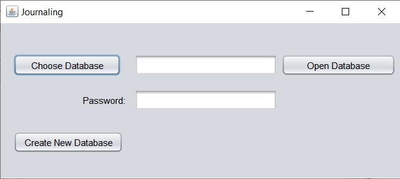
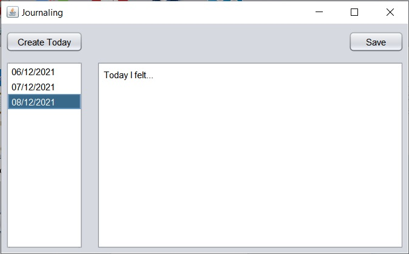

# Journaling 

A dead single Java APP to keep a journal. Its written using Java Swing and [Sqlite-jdbc-crypt](https://github.com/Willena/sqlite-jdbc-crypt). Uses SQLChipher version 4 to encrypt the database.
Requires at least Java SDK 16.

## Screenshots

### "Login"

### Main screen
